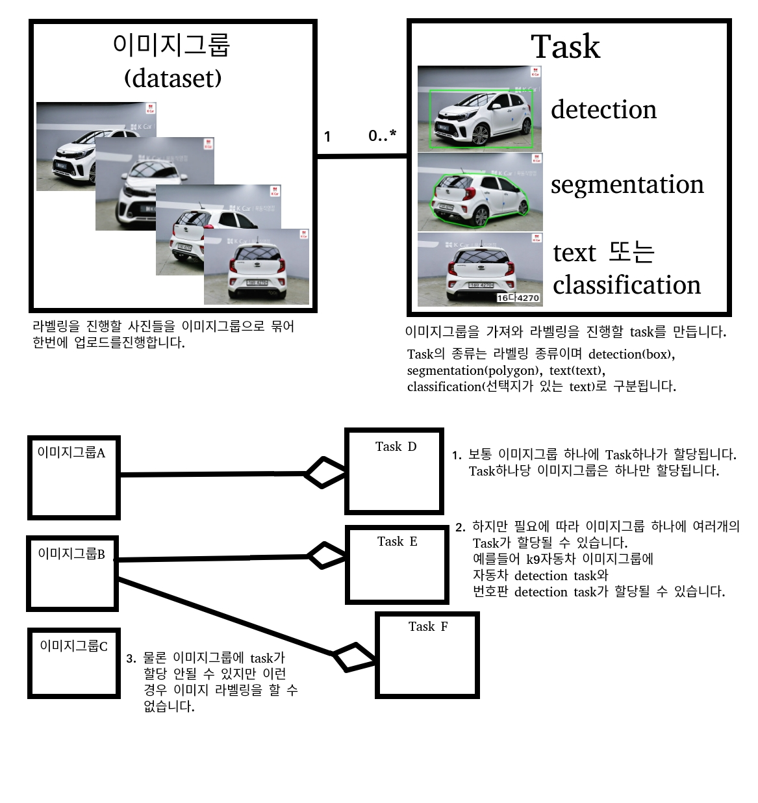

# Summary


# label_app

DB 명세서 API 문서 참조
   
[API 문서](./LABEL_APP_API.xlsx)

<br>
<br>

## Labeling_app 개발을 위한 기본 세팅 실행 순서 

1. Labeling app repository clone 및 config path 생성
```
git clone https://github.com/yeomyeom/sevenmeerkat.git
cd labelling_app
mkdir config
```   

<br>

2. python virtualenv 설정  (**python3** 만 지원)
```
virtualenv venv --python={실행하고자 하는 python 경로 ex)/usr/local/bin/python3}
source venv/bin/activate
```

<br>

3. 활성화된 python virtual environment (위에서는 venv라는 이름으로 생성) 에서 관련 python package 설치 
```
pip install -r requirements.txt
```

<br>

4. labeling app 에서 사용되는 환경변수 설정 
```
cd labeling_app
mkdir config
```
- 해당 repo의 path에서 config directory 만든 후
- gitlab의 labeling_app wiki 페이지에서 .env 파일 다운 또는 내용 복사하여 config directory에 `.env`파일 만들기

<br>

5. mongoDB 실행 (본 서비스는 mongoDB를 사용하기 때문에 local 환경에서 mongoDB 띄우고 개발해야됨)
```
cd mongo_docker
docker-compose -f docker-compose-mongo.yml up -d
```
<br>

6. 서버 실행하기 
```
python run.py
``` 

*참고1) Labeling_app 서버는 기본적으로 localhost:5000 에서 실행되게 되어있음*


*참고2) Labeling_app mongoDB는 기본적으로 localhost:27018 에서 실행되게 되어있음*

<br>
<br>
<br>

## Tensorflow record 파일을 만들기 위한 작업
1. 필요한 패키지 설지
``` bash
sudo apt-get install protobuf-compiler python-pil python-lxml python-tk
```
   
참고로 필요한 파이썬 패키지들은 위에 requirment.txt에 다 적혀있어서 걱정 안해도 된다.
   
2. model/research 디렉토리 설치
   
tensorflow 디렉토리에 models/research 디렉토리가 없다면 [Tensorflow model file for 1.13.0](https://github.com/tensorflow/models/archive/v1.13.0.zip) 다운로드 이후
``` bash
cp models-1.13.0.zip venv/lib/python3.6/site-packages/tensorflow/
cd venv/lib/python3.6/site-packages/tensorflow/
unzip models-1.13.0.zip
mv models-1.13.0.zip models
```

3. COCO API installation
```bash
git clone https://github.com/cocodataset/cocoapi.git
cd cocoapi/PythonAPI
make
cp -r pycocotools <path_to_tensorflow>/models/research/
echo 위에 명령어가 밑에 명령어랑 같은 말이다.
cp -r pycocotools venv/lib/python3.6/site-packages/tensorflow/models/research
```

4. Protobuf Compilation
   
Tensorflow object detection api 는 protobufs 확장자를 모델 설정과 학습 파라미터 설정하는데 사용한다. 이 프레임 워크를 사용하기 전에 Protobuf 라이브러리들을 컴파일 할 필요가 있다. 밑에 있는 명령어를 tensorflow/models/research/ 디렉토리에서 진행해야한다. 아마 tensorflow 를 pip install 했다면 object_detection 이라는 디렉토리가 있을 것이다.

``` bash
# From tensorflow/models/research/
protoc object_detection/protos/*.proto --python_out=.
```

이러면 환경 구축 끝

---

# 폴더 구성

label_app : flask 코드

postman_query : postman 앱을 이용해 flask 테스트

requirements.txt : pip install -r 용도 파일

run.py : flask 실행 파일 python3 run.py 로 서버 구동 가능


## Idea 1
annotation 별로 collection(table)을 나눔

collection 안에 field 값들은 다 Task name 으로 한다.

그럼 일단 text에 angle 값 저장하는게 문제인데 이것은 나중에 협의 하여 진행한다다

```
=============================
profile // 로그인 정보 저장하는 테이블
|--user_id
|--email
|--password
|--counts
|--connect //  접속 기록
==============================
dataset // 전체 이미지 label 값 이외의 정보들
|--filename
|--upload_time
|--height
|--width
|--group
|--두줄 번호판
|	--kind: text
|	--labels: 텍스트
|	--is_checked
|--sedan_car
|	--kind: segmentation
|	--labels: 폴리곤 형태
|	--is_checked
@ object 이름 말고 Task 이름으로 field 추가가
|--k5_car
|	--kind: detection
|	--is_checked
|	--labels: 박스 형태
|--k3_plate
|	--is_checked
|	--labels
|--rhl
|	--kind: selection
|	--labels
|	--is_checked
|--lhl
|	--kind: selection
|	--labels
|	--is_checked
================================
image_group
|--group
================================
task_group
|--name
|--group
|--comment
|--kind(text, detection, segmentation, selection)
|--example --> 예시 이미지들
|--size---> 예시 이미지의 가로 세로 넓이
================================

```
Embedded ( 라벨된 정보와 이미지 정보는 Strong Association이기 때문에 읽기 성능을 위해서 라벨된 정보와 이미지 정보를 한 collection에 저장한다.)
   
장점: 내가 원하는 사진을 가져올 때 해당 collection 에서 find 하면 된다.
   
join 연산을 줄일 수 있다.
   
각 페이지 별로 web 뷰와 flask 간에 데이터 통신할 변수 이름

- flask app.py 역할에 해당하는 route.py 에는 페이지간 이동, 데이터 송수신 담당
- task_code 디렉토리 안에 있는 코드들은 백엔드에서 처리할 로직들 담당
   
예시 : from label_app.task_code import database
   
mongodb = database.db_open() // mongodb와 연결
   
# 문제점
   ```
|--text
| 	--angle
|		--labels
|		--is_checked
|	--is_checked
|	--labels
```
이미지 회전 정보 같은건 어떻게 넣을 것인가? 따로 기준을 하나더 만들어야하나?
   
   
# 구현하다보니 바뀐점
   
## <이미지 업로드 할때>   
### input   

group(이름 문자열), group_comment(설명 문자열), file_list(업로드할 이미지들 storagedict), button(어떤 버튼이 눌렸는지 문자열)   

### output   

file_fail(업로드 실패한 파일 이름 리스트), file_num(업로드 시도한 파일 개수 int), fiel_success(업로드 성공한 파일 이름 리스트), image_group(이미지 그룹과 그룹 설명이 들어있는 dictionary)   
   
```
1. 이미지 업로드 할 때 그룹 명을 같게 하면 그룹명이 겹친다는 메시지를 띄우는 것이 아니라 그룹이 확장된다. (다운로드 할 때 라벨링이 안된 것 빼고 다운로드 하기)

2. 
file_num 파일 갯수
file_success: 업로드 성공한 이미지 이름
file_fail: 업로드 실패한 이미지 이름
image_group : 이미지 그룹 종류

3. 아직 그룹 이름이나 설명 수정 기능 추가 안함
다만 B: CCCC 가 업로드 되어있는데 B: BBBB 를 업로드 하려 하면 B 그룹 이미지가 확장되고 설명이 CCCC에서 BBBB로 바뀐다. 

```

## <Task 새로 만들때>
```
1. 라벨링을 하지 않으면 annotation field 가 없다. annotation field 가 필요한 이유
 mondodb에서는 스키마가 고정되어 있지 않기 때문에 document의 구조를 알 수가 없다.
 따라서 해당 document가 어떤 라벨링이 되어있는지 알기 위해 따로 라벨링 필드를 만들어야 관리가 쉬움

2. Task 이름, 라벨링 타입(ocr, seg,...), 이미지 그룹 이 동일한데 입력을 했다면 comment 만 수정된다. -> 일종에 수정기능

3. Task 이름만 같다면 그 Task는 생성되지 않는다.

```